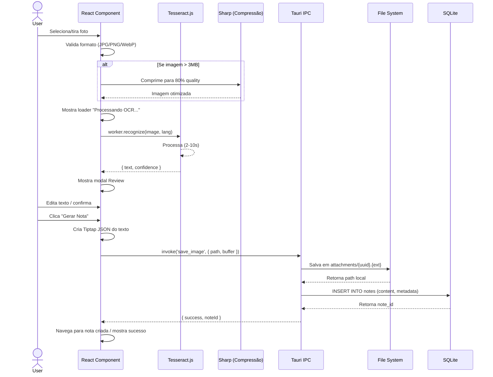

# Image to Text Feature - Especificação Técnica Detalhada

**Versão**: 1.0  
**Data**: 2026-09-30  
**Status**: Planejamento  
**Autor**: Claude Haiku 4.5

---

## 1. Visão Geral

A feature **Image to Text** permite que usuários capturem ou importem imagens contendo texto, os quais são automaticamente transcritos via OCR (Optical Character Recognition), revisados e convertidos em notas estruturadas no Nodi.

### 1.1 Objetivos
- ✅ Acelerar captura de anotações via câmera/imagens
- ✅ Eliminar transcrição manual
- ✅ Garantir qualidade via review humano
- ✅ Integração seamless com sistema de notas existente

### 1.2 Contexto de Restrições
- **Stack**: Tauri + React + TypeScript
- **Banco**: SQLite
- **Formato de nota**: Tiptap JSON
- **Attachments**: Fora do SQLite (file system)
- **Sem backend**: Processamento local apenas
- **Acessibilidade**: Obrigatória (WCAG 2.1 AA)

---

## 2. Arquitetura de Alto Nível

```
┌──────────────────────────────────────────────────────────┐
│                     FRONTEND (React)                      │
├──────────────────────────────────────────────────────────┤
│                                                            │
│  ┌─────────────┐    ┌──────────────┐   ┌──────────────┐  │
│  │   Capture   │───▶│  OCR Module  │──▶│ Review Modal │  │
│  │   Component │    │(Tesseract.js)│   │   (React)    │  │
│  └─────────────┘    └──────────────┘   └──────────────┘  │
│                                              │             │
│                                              ▼             │
│                                      ┌──────────────┐     │
│                                      │ Note Creator │     │
│                                      │   (Tiptap)   │     │
│                                      └──────────────┘     │
│                                              │             │
└──────────────────────────────────────────────┼─────────────┘
                                               │
┌──────────────────────────────────────────────▼─────────────┐
│                  TAURI BACKEND (Rust)                       │
├──────────────────────────────────────────────────────────┤
│                                                            │
│  ┌─────────────────┐    ┌──────────────┐                 │
│  │ File Operations │───▶│  SQLite Ops  │                 │
│  │ (Save Images)   │    │ (Create Note)│                 │
│  └─────────────────┘    └──────────────┘                 │
│                                                            │
└──────────────────────────────────────────────────────────┘
                                               │
┌──────────────────────────────────────────────▼─────────────┐
│                    DATA LAYER                              │
├──────────────────────────────────────────────────────────┤
│                                                            │
│  ┌──────────────────┐    ┌──────────────────┐            │
│  │ SQLite Database  │    │ File System      │            │
│  │ (Metadata)       │    │ (Images/Exports) │            │
│  └──────────────────┘    └──────────────────┘            │
│                                                            │
└──────────────────────────────────────────────────────────┘
```

---

## 3. Dependências & Ferramentas

### 3.1 Bibliotecas NPM

```json
{
  "dependencies": {
    "tesseract.js": "^5.0.0",
    "sharp": "^0.33.0",
    "uuid": "^9.0.0"
  },
  "devDependencies": {
    "@testing-library/react": "^14.0.0",
    "vitest": "^1.0.0"
  }
}
```

| Lib | Versão | Propósito | Justificativa |
|-----|--------|----------|---------------|
| **tesseract.js** | 5.0.0 | OCR local | Sem backend, suporta +100 idiomas, ~14MB |
| **sharp** | 0.33.0 | Compressão imagem | Reduz payload antes OCR (performance) |
| **uuid** | 9.0.0 | IDs únicos | Para attachments e referências |

### 3.2 Recursos Tauri

- `invoke` - Chamadas IPC para operações de arquivo
- `fs` - Leitura/escrita no file system
- `path` - Resolução de caminhos

---

## 4. Fluxo de Dados Detalhado

### 4.1 Sequência de Operações



### 4.2 Estados da Aplicação

```typescript
type ImageToTextState = 
  | 'idle'                    // Aguardando ação
  | 'selecting'               // Selecionando arquivo
  | 'processing_ocr'          // Tesseract rodando
  | 'review'                  // Esperando aprovação
  | 'saving'                  // Salvando nota
  | 'success'                 // Nota criada
  | 'error_ocr'               // Falha no OCR
  | 'error_save'              // Falha ao salvar
```

---

## 5. Componentes React

### 5.1 Estrutura de Pastas

```
src/
├── features/
│   └── imageToText/
│       ├── components/
│       │   ├── ImageToTextButton.tsx      // Entry point
│       │   ├── ImageToTextModal.tsx       // Modal principal
│       │   ├── ImageUploader.tsx          // Seletor de arquivo
│       │   ├── OCRReview.tsx              // Editor de texto
│       │   └── OCRPreview.tsx             // Visualização lado a lado
│       ├── hooks/
│       │   ├── useOCR.ts                  // OCR logic
│       │   ├── useImageCompression.ts     // Compressão
│       │   └── useImageToNote.ts          // Flow completo
│       ├── types.ts                       // TypeScript types
│       ├── utils/
│       │   ├── tesseract.ts               // Wrapper Tesseract
│       │   ├── imageValidation.ts         // Validações
│       │   └── tiptapGenerator.ts         // Gera JSON
│       └── __tests__/
│           ├── ImageToTextModal.test.tsx
│           ├── useOCR.test.ts
│           └── tiptapGenerator.test.ts
```

### 5.2 Componentes Principais

#### **ImageToTextButton.tsx**
Botão que abre o modal. Integrado na navbar/menu principal.

```typescript
interface ImageToTextButtonProps {
  onNoteCreated?: (noteId: string) => void;
  className?: string;
}
```

#### **ImageToTextModal.tsx**
Modal container que orquestra todo o fluxo.

```typescript
interface ImageToTextModalProps {
  isOpen: boolean;
  onClose: () => void;
  onSuccess: (noteId: string) => void;
}

// Estados internos:
// - idle → selecting → processing_ocr → review → saving → success
```

#### **ImageUploader.tsx**
Componente para seleção de arquivo ou captura de câmera.

```typescript
interface ImageUploaderProps {
  onImageSelected: (file: File) => void;
  isLoading?: boolean;
}
```

#### **OCRReview.tsx**
Modal de review com editor do texto extraído.

```typescript
interface OCRReviewProps {
  imageUrl: string;
  extractedText: string;
  confidence: number;
  onApprove: (editedText: string) => void;
  onRetry: () => void;
  onCancel: () => void;
  isLoading?: boolean;
}
```

---

## 6. Hooks Customizados

### 6.1 `useOCR.ts`

Gerencia processamento de OCR com Tesseract.

```typescript
interface UseOCRReturn {
  isLoading: boolean;
  error: string | null;
  result: { text: string; confidence: number } | null;
  recognizeImage: (imageUrl: string, language: string) => Promise<void>;
  reset: () => void;
}

function useOCR(): UseOCRReturn {
  // Carrega worker Tesseract
  // Gerencia lifecycle (create, terminate)
  // Trata erros e timeouts (30s max)
  // Retorna text + confidence score
}
```

### 6.2 `useImageCompression.ts`

Redimensiona e comprime imagens antes OCR.

```typescript
interface CompressionOptions {
  maxWidth?: number;      // default: 2000px
  maxHeight?: number;     // default: 2000px
  quality?: number;       // default: 0.8 (80%)
  format?: 'jpeg' | 'png' | 'webp'; // default: 'jpeg'
}

function useImageCompression(
  options?: CompressionOptions
): {
  compress: (file: File) => Promise<Blob>;
  isLoading: boolean;
  error: string | null;
}
```

### 6.3 `useImageToNote.ts`

Orquestra todo o fluxo: captura → OCR → review → salvar.

```typescript
interface ImageToNoteFlow {
  state: ImageToTextState;
  image: File | null;
  ocrResult: { text: string; confidence: number } | null;
  
  startCapture: () => Promise<void>;
  processOCR: (language: string) => Promise<void>;
  saveNote: (editedText: string, tags?: string[]) => Promise<string>;
  cancel: () => void;
  retry: () => void;
}

function useImageToNote(onSuccess?: (noteId: string) => void): ImageToNoteFlow
```

---

## 7. Tipos TypeScript

### 7.1 `types.ts`

```typescript
// Resultado do OCR
interface OCRResult {
  text: string;
  confidence: number;
  language: string;
  processingTimeMs: number;
}

// Metadata de nota criada via imagem
interface ImageToTextNoteMetadata {
  type: 'image_to_text';
  sourceImagePath: string;        // Relative path to attachment
  originalFileName: string;
  confidence: number;
  extractedAt: ISO8601Timestamp;
  userApprovedAt: ISO8601Timestamp;
  editedByUser: boolean;          // Se usuário editou o texto
}

// Representação de imagem carregada
interface LoadedImage {
  file: File;
  preview: string;                // Data URL para preview
  sizeBytes: number;
  format: 'jpeg' | 'png' | 'webp';
  width: number;
  height: number;
}

// Estado global do modal
interface ImageToTextModalState {
  isOpen: boolean;
  step: 'upload' | 'processing' | 'review' | 'saving';
  image: LoadedImage | null;
  ocrResult: OCRResult | null;
  error: { step: string; message: string } | null;
  selectedLanguage: string;       // ISO 639-1 code
}
```

---

## 8. Utilitários

### 8.1 `tesseract.ts`

Wrapper ao redor de Tesseract.js com tratamento de erro.

```typescript
class TesseractService {
  private static worker: Tesseract.Worker | null = null;
  
  static async initialize(): Promise<void>
  static async recognize(
    imageUrl: string,
    language: string
  ): Promise<OCRResult>
  static async getLanguages(): Promise<string[]>
  static terminate(): Promise<void>
}

// Timeout: 30 segundos por operação
// Fallback: retorna erro gracioso se OCR falhar
```

### 8.2 `imageValidation.ts`

Valida imagens antes processamento.

```typescript
interface ValidationResult {
  isValid: boolean;
  errors: string[];
}

function validateImage(file: File): ValidationResult {
  // Checks:
  // - Formato (JPG, PNG, WebP, HEIC)
  // - Tamanho max (10MB)
  // - Dimensões (min 300x300px)
  // - Não corrompido
}

async function validateImageDimensions(
  file: File
): Promise<{ width: number; height: number }>
```

### 8.3 `tiptapGenerator.ts`

Converte texto extraído em Tiptap JSON.

```typescript
interface TiptapNode {
  type: string;
  content?: TiptapNode[];
  text?: string;
  marks?: Array<{ type: string }>;
}

function textToTiptapJSON(text: string): TiptapNode[] {
  // Converte texto plano em JSON estruturado:
  // - Parágrafos (quebras de linha)
  // - Links detectados automaticamente (opcional)
  // - Preserva formatação básica
  
  const doc: TiptapNode = {
    type: 'doc',
    content: [
      {
        type: 'paragraph',
        content: [{ type: 'text', text: 'Texto extraído...' }]
      }
    ]
  };
  
  return doc;
}
```

---

## 9. Camada Tauri (Rust)

### 9.1 Comandos IPC

```rust
#[tauri::command]
async fn save_image(
    path: String,
    buffer: Vec<u8>,
    app_handle: tauri::AppHandle,
) -> Result<String, String> {
    // 1. Valida diretório attachments/
    // 2. Salva buffer em attachments/{uuid}.jpg
    // 3. Retorna path relativo
}

#[tauri::command]
async fn create_note_from_image(
    content: String,           // Tiptap JSON
    metadata: NoteMetadata,    // Image source info
    attachment_path: String,   // Relative path
) -> Result<String, String> {
    // 1. Valida attachment existe
    // 2. INSERT nota em SQLite
    // 3. Retorna note_id
}

#[tauri::command]
fn get_attachment_path(note_id: String) -> Result<String, String> {
    // Retorna path do attachment associado à nota
}
```

### 9.2 Estrutura do Banco

#### Migration: `add_image_to_text_columns.sql`

```sql
-- Adiciona suporte a Image to Text

-- 1. Nova coluna em 'notes' para metadata
ALTER TABLE notes 
ADD COLUMN metadata JSON;

-- 2. Índice para performance
CREATE INDEX idx_notes_metadata 
ON notes(json_extract(metadata, '$.type'));

-- 3. Versão da schema
PRAGMA user_version = 3;
```

**Nota**: Migrations são imutáveis. Não modificar após commit.

#### Exemplo de Registro

```json
{
  "id": "note_123",
  "title": "Recibo de compra",
  "content": "{\"type\": \"doc\", \"content\": [...]}",
  "metadata": {
    "type": "image_to_text",
    "sourceImagePath": "attachments/e8c3f2e1.jpg",
    "originalFileName": "receipt_2026.jpg",
    "confidence": 0.92,
    "extractedAt": "2026-09-30T14:23:00Z",
    "userApprovedAt": "2026-09-30T14:24:30Z",
    "editedByUser": true
  },
  "created_at": "2026-09-30T14:24:30Z"
}
```

---

## 10. Fluxo UX Detalhado

### 10.1 Cenário Principal

```
1. Usuário clica botão "📷 Foto"
   ↓
2. Modal abre → Opções:
   - Upload arquivo
   - Tirar foto (câmera)
   - Cancelar
   ↓
3. Seleciona imagem
   └─ Validação: formato, tamanho
   └─ Preview em miniatura
   ↓
4. Modal mostra "Processando OCR..."
   └─ Loader com mensagem
   └─ Pode cancelar (termina worker)
   ↓
5. OCR retorna texto
   └─ Modal muda para "Review"
   ↓
6. Preview lado a lado:
   ├─ Imagem (esquerda)
   └─ Textarea editável (direita)
   └─ Confidence score exibido
   ↓
7. Usuário pode:
   - Editar texto
   - Clicar "Novo OCR" (retentativa)
   - Clicar "Cancelar"
   - Clicar "Gerar Nota" (criar)
   ↓
8. Salvando...
   └─ Imagem → file system
   └─ Nota → SQLite
   ↓
9. Sucesso! Nova nota criada
   └─ Notificação toast
   └─ Navega para nota
   └─ Modal fecha
```

### 10.2 Tratamento de Erros

| Erro | Causa | Ação |
|------|-------|------|
| **Imagem inválida** | Formato/tamanho | Mostra alerta, volta a upload |
| **OCR timeout** | >30s de processamento | Retry automático 1x, depois erro |
| **Confidence baixa** | <50% acurácia | Warning visual mas permite salvar |
| **Falha ao salvar** | FS/DB error | Mostra erro + opção "Tentar novamente" |

---

## 11. Acessibilidade (WCAG 2.1 AA)

### 11.1 Checklist

- [ ] Keyboard navigation (Tab, Enter, Esc)
- [ ] ARIA labels em botões/inputs
- [ ] `aria-live` para loading states
- [ ] Contrast ratio ≥ 4.5:1 (texto)
- [ ] Descrições de imagens via `alt`
- [ ] Focus visible (outline não removido)
- [ ] Responsive em mobile (touch targets ≥44px)
- [ ] Sem autoplay de sons/videos
- [ ] Testes com screen reader (NVDA/VoiceOver)

### 11.2 Implementação

```tsx
// Exemplo de componente accessible
<button
  aria-label="Tirar foto com câmera"
  aria-pressed={isRecording}
  onClick={startCamera}
  className="camera-button"
>
  <Camera size={24} aria-hidden="true" />
</button>

// Modal review
<dialog
  open={isOpen}
  aria-labelledby="review-title"
  aria-describedby="review-help"
>
  <h2 id="review-title">Revisar texto extraído</h2>
  <textarea
    aria-label="Texto extraído - edite conforme necessário"
    value={text}
    onChange={handleEdit}
  />
</dialog>
```

---

## 12. Testes

### 12.1 Testes Unitários

```typescript
// __tests__/useOCR.test.ts
describe('useOCR', () => {
  it('deve processar imagem com sucesso', async () => {
    const { result } = renderHook(() => useOCR());
    await act(async () => {
      await result.current.recognizeImage('test.jpg', 'por');
    });
    expect(result.current.result?.text).toBeDefined();
  });

  it('deve timeout após 30s', async () => {
    // Mock Tesseract para delay longo
  });

  it('deve limpar worker ao desmontar', () => {
    // Verify worker.terminate() called
  });
});

// __tests__/tiptapGenerator.test.ts
describe('textToTiptapJSON', () => {
  it('deve gerar JSON válido do Tiptap', () => {
    const result = textToTiptapJSON('Olá mundo');
    expect(result).toHaveProperty('type', 'doc');
    expect(result.content).toBeDefined();
  });

  it('deve preservar quebras de linha', () => {
    const text = 'Linha 1\nLinha 2';
    const result = textToTiptapJSON(text);
    // Verificar 2 parágrafos
  });
});

// __tests__/imageValidation.test.ts
describe('validateImage', () => {
  it('deve aceitar JPG válido', () => {
    const file = new File([], 'test.jpg', { type: 'image/jpeg' });
    expect(validateImage(file).isValid).toBe(true);
  });

  it('deve rejeitar arquivo >10MB', () => {
    const large = new File(
      [new ArrayBuffer(11 * 1024 * 1024)],
      'large.jpg'
    );
    expect(validateImage(large).isValid).toBe(false);
  });

  it('deve rejeitar imagem <300x300px', async () => {
    // Mock dimensions check
  });
});
```

### 12.2 Testes de Integração

```typescript
// __tests__/ImageToTextModal.test.tsx
describe('ImageToTextModal', () => {
  it('deve completar fluxo completo: upload → OCR → review → save', async () => {
    const { getByText, getByLabelText } = render(
      <ImageToTextModal isOpen={true} onSuccess={jest.fn()} />
    );

    // 1. Upload
    const file = createTestImageFile();
    const input = getByLabelText('upload');
    fireEvent.change(input, { target: { files: [file] } });

    // 2. Aguarda OCR
    await waitFor(() => {
      expect(getByText('Revisar texto extraído')).toBeInTheDocument();
    });

    // 3. Edita texto
    const textarea = getByLabelText('Texto extraído');
    fireEvent.change(textarea, { target: { value: 'Texto editado' } });

    // 4. Salva
    fireEvent.click(getByText('Gerar Nota'));

    // 5. Verifica sucesso
    await waitFor(() => {
      expect(onSuccess).toHaveBeenCalledWith(expect.stringMatching(/^note_/));
    });
  });
});
```

### 12.3 Testes E2E (Cypress)

```javascript
// e2e/imageToText.cy.js
describe('Image to Text Feature', () => {
  it('deve criar nota a partir de imagem', () => {
    cy.visit('/');
    cy.get('[aria-label="Foto"]').click();
    
    // Upload imagem
    cy.get('input[type="file"]').attachFile('receipt.jpg');
    cy.contains('Processando OCR...').should('be.visible');
    
    // Aguarda OCR
    cy.contains('Revisar texto extraído', { timeout: 15000 }).should('be.visible');
    
    // Edita
    cy.get('textarea').clear().type('Novo texto');
    
    // Salva
    cy.contains('button', 'Gerar Nota').click();
    
    // Verifica redirecionamento
    cy.url().should('match', /\/notes\/note_/);
    cy.contains('Nota criada com sucesso').should('be.visible');
  });
});
```

---

## 13. Performance & Otimizações

### 13.1 Métricas Alvo

| Métrica | Alvo | Nota |
|---------|------|------|
| Upload | <100ms | Validação local |
| OCR | 2-10s | Tesseract.js no browser |
| Compressão | <500ms | Sharp |
| Salvar nota | <1s | SQLite + FS |
| **Total** | **<12s** | UX aceitável |

### 13.2 Estratégias

1. **Lazy load Tesseract**: Carrega worker só quando abrir modal
2. **Web Workers**: OCR em thread separada (não trava UI)
3. **Compressão agressiva**: Max 3MB → 800KB antes OCR
4. **Caching**: Cache de idiomas Tesseract localmente
5. **Índices SQLite**: Query rápida de notas por tipo

### 13.3 Monitoramento

```typescript
// Captura métricas
interface PerformanceMetrics {
  uploadTimeMs: number;
  compressionTimeMs: number;
  ocrTimeMs: number;
  saveTimeMs: number;
  totalTimeMs: number;
}

function captureMetrics(phase: string, duration: number) {
  if (process.env.NODE_ENV === 'development') {
    console.log(`[ImageToText] ${phase}: ${duration}ms`);
  }
}
```

---

## 14. Integração com UI Existente

### 14.1 Entrada de Pontos

1. **Navbar/Header**: Botão "📷" no menu principal
2. **Floating Action Button (FAB)**: Em páginas de notas
3. **Context Menu**: Clique direito → "Adicionar foto"
4. **Atalho**: Cmd+Shift+P (capturar foto)

### 14.2 Navegação

```typescript
// Após salvar nota, navegar para ela
const handleNoteCreated = (noteId: string) => {
  navigate(`/notes/${noteId}`, { replace: false });
};
```

### 14.3 Sincronização com Estado Global

```typescript
// Se usando Redux/Zustand:
// Dispatch ação para atualizar store de notas
dispatch(addNote({ id, content, metadata }));
```

---

## 15. Roadmap de Implementação

### **Sprint 1: Setup & Core** (2-3 dias)
- [ ] Adicionar dependências (tesseract.js, sharp)
- [ ] Setup Tauri commands para file operations
- [ ] Criar types e utilitários básicos
- [ ] Implementar `useOCR` hook

### **Sprint 2: UI Components** (2-3 dias)
- [ ] Componente ImageUploader
- [ ] Modal base (ImageToTextModal)
- [ ] Componente OCRReview
- [ ] Integração de Tesseract.js

### **Sprint 3: Business Logic** (2 dias)
- [ ] `useImageToNote` hook (orquestração)
- [ ] `tiptapGenerator` (conversão)
- [ ] Compressão de imagens
- [ ] Salvar em SQLite

### **Sprint 4: Polish & Tests** (1-2 dias)
- [ ] Testes unitários (useOCR, validation, tiptap)
- [ ] Testes integração (modal completo)
- [ ] Acessibilidade (WCAG checklist)
- [ ] Tratamento de erros robusto

### **Sprint 5: Deployment** (1 dia)
- [ ] E2E tests (Cypress)
- [ ] Performance optimization
- [ ] Documentation
- [ ] Screenshot do ABOUT page

---

## 16. Riscos & Mitigações

| Risco | Probabilidade | Impacto | Mitigação |
|-------|---------------|--------|-----------|
| OCR impreciso | Alta | Médio | Review obrigatória pelo usuário |
| Performance (OCR lento) | Média | Alto | Compressão agressiva + worker thread |
| Incompatibilidade navegador | Baixa | Alto | Fallback para API externa (futura) |
| Corrupção arquivo | Baixa | Alto | Validação + checksum antes salvar |
| Permissões câmera | Média | Baixo | Tratamento gracioso de negação |

---

## 17. Checklist Final (Antes da Produção)

- [ ] Todos testes passando (unit + integration + E2E)
- [ ] WCAG 2.1 AA compliance validado
- [ ] Performance metrics < targets
- [ ] Documentação atualizada
- [ ] Migrations testadas (SQLite)
- [ ] Rollback plan (se necessário)
- [ ] Screenshot adicionada ao ABOUT page
- [ ] CLI validation (`npm run validate`)

---

## Apêndice A: Referências de Tesseract.js

```javascript
// Inicializar worker
const { createWorker } = Tesseract;
const worker = await createWorker();

// Configurar idioma
await worker.loadLanguage('por+eng');
await worker.initialize('por+eng');

// Processar imagem
const { data: { text, confidence } } = 
  await worker.recognize('path/to/image.jpg');

// Limpar recursos
await worker.terminate();
```

**Idiomas Suportados**: por, eng, spa, fra, deu, ita, jpn, kor, zho, rus, ara, etc.

---

## Apêndice B: Schema SQLite (Referência)

```sql
CREATE TABLE IF NOT EXISTS notes (
  id TEXT PRIMARY KEY,
  title TEXT,
  content TEXT NOT NULL,     -- Tiptap JSON
  metadata JSON,              -- NEW: { type, sourceImagePath, confidence, ... }
  created_at TEXT NOT NULL,
  updated_at TEXT,
  deleted_at TEXT,
  CHECK (json_valid(content))
);

-- Index para queries rápidas
CREATE INDEX IF NOT EXISTS idx_notes_type 
ON notes(json_extract(metadata, '$.type'));
```

---

**Documento Finalizado**  
Pronto para implementação com Opus 5.5.
