# ABOUT — The making of NODI

This page is the durable source record for the visual history presented by the in-app **ABOUT** page.

Every completed implementation task adds one chronological entry and one immutable screenshot of the current native NODI window. Screenshots are stored in `docs/about/screenshots/` and must never contain other applications or unrelated desktop content.

## 001 — FND-001 Native shell

**Completed:** September 7, 2026  
**Commit:** `5b9d9ee`

The first NODI window: a clean Tauri 2, React, TypeScript, and Vite baseline running natively on macOS.

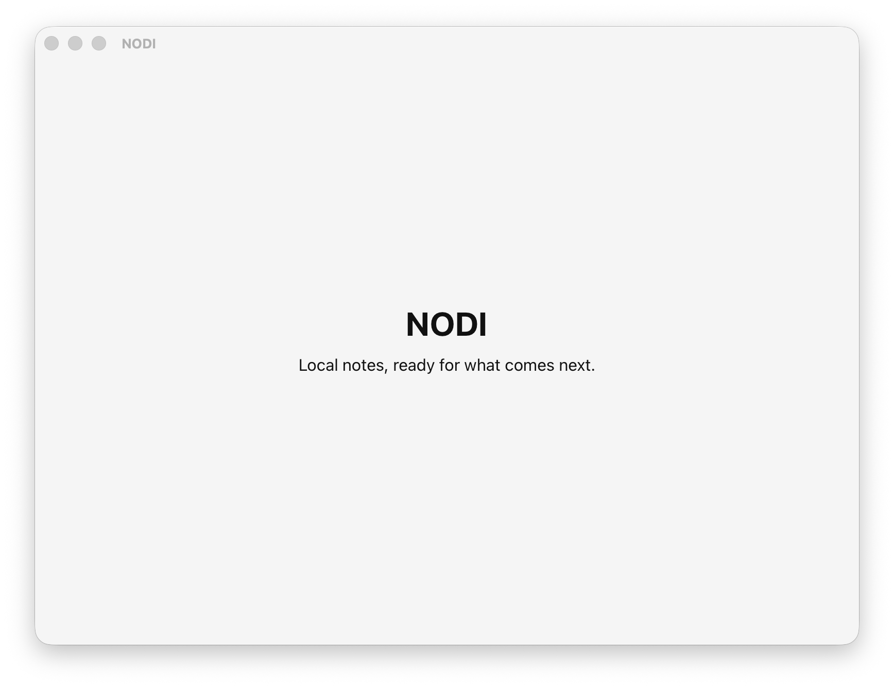

## 002 — DOC-001 Visual history rule

**Completed:** September 7, 2026

ABOUT was added as a permanent, accessible timeline inside NODI. Capturing the current native window and adding an evolution entry is now part of every implementation task's Definition of Done.

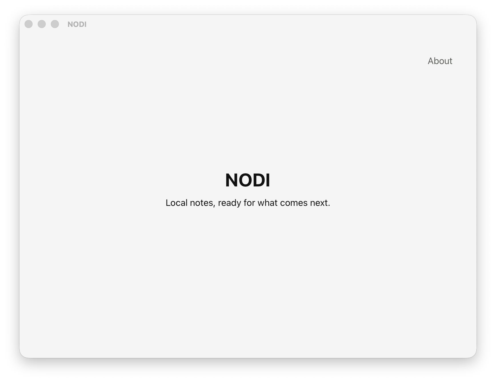

## 003 — FND-002 Tooling

**Completed:** September 7, 2026

The interface remains intentionally stable while the project gains a reliable development loop: TypeScript checking, Biome linting and formatting, Vitest component tests, and Playwright browser-level tests.

## 004 — FND-003 Project structure

**Completed:** September 7, 2026

The visible baseline stays stable while application startup, global styles, and ABOUT move into clear, one-directional project layers. Future feature directories will be created only when they contain real implementation, avoiding empty speculative abstractions.

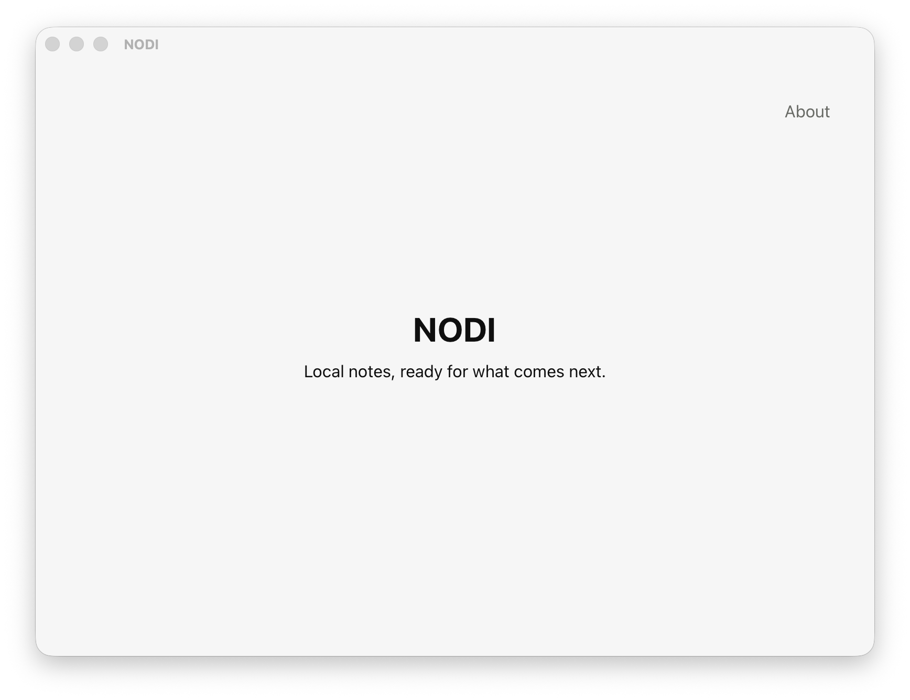

## 005 — FND-004 Design tokens

**Completed:** September 7, 2026

NODI gains a shared visual foundation for color, typography, spacing, borders, radii, and motion. An accessible theme selector supports System, Light, and Dark preferences, persists the choice locally, and applies the same tokens to ABOUT.

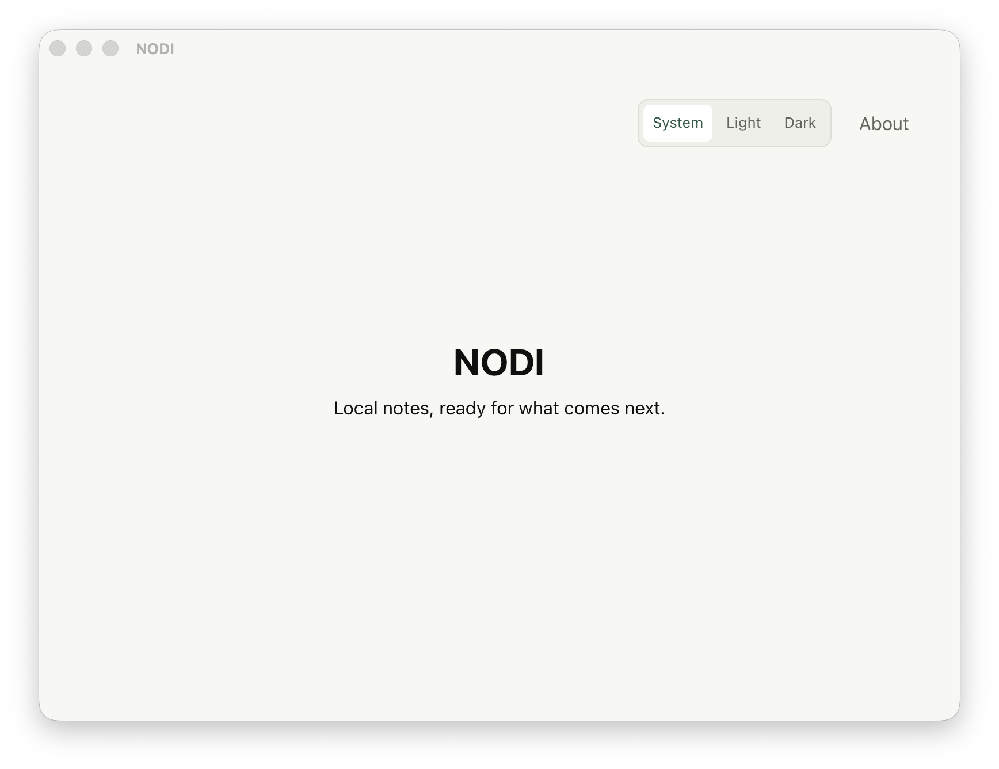

### Dark mode

The ABOUT timeline and its historical screenshots remain readable and visually consistent when NODI follows a dark appearance.

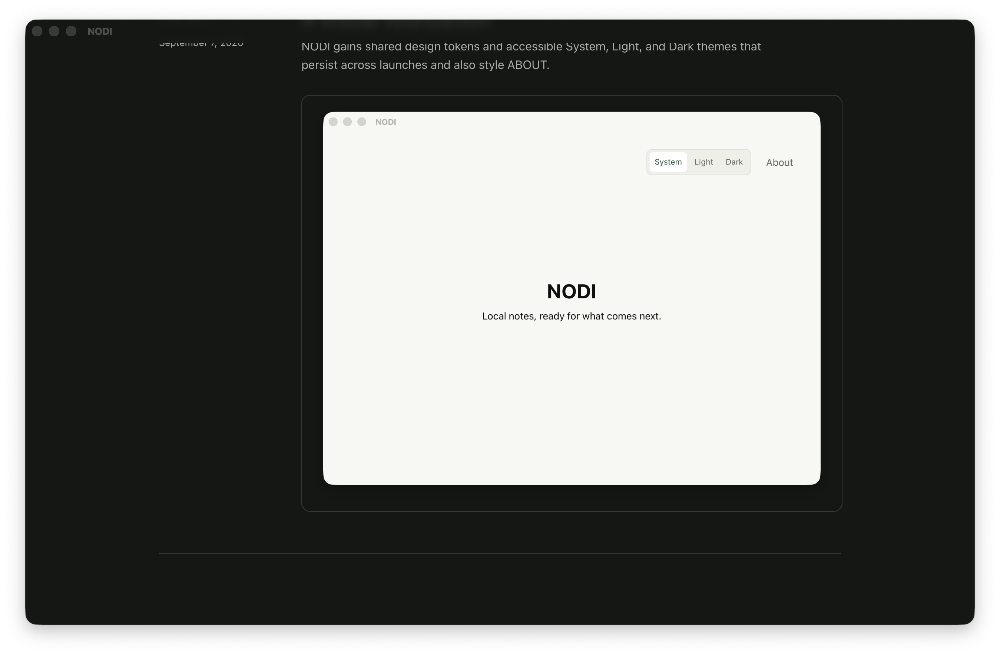

## 006 — FND-005 Desktop shell

**Completed:** September 7, 2026

The native window becomes NODI's stable three-column workspace: a 232px sidebar, a 320px note list, and a flexible editor canvas. Semantic regions, visible focus, honest empty states, and a 900px minimum window width establish the foundation for note features without exposing unfinished destinations.

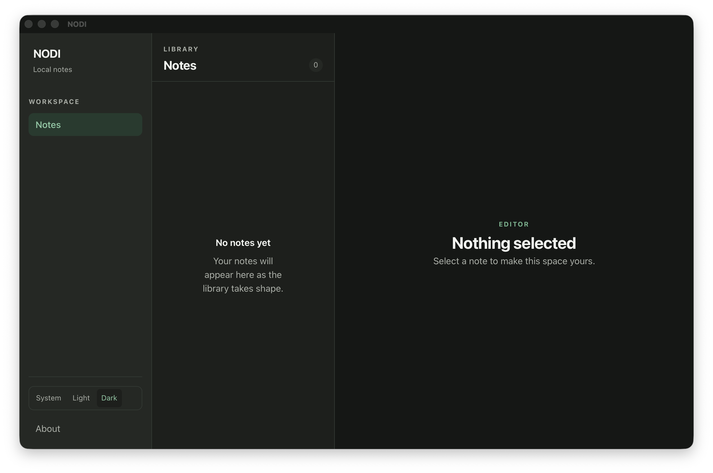

## 007 — DB-001 SQLite connection

**Completed:** September 7, 2026

NODI now opens its SQLite database in the macOS application data directory before rendering the workspace. Foreign-key enforcement, write-ahead logging, and a five-second busy timeout establish a reliable local source of truth without placing user data inside the project repository.

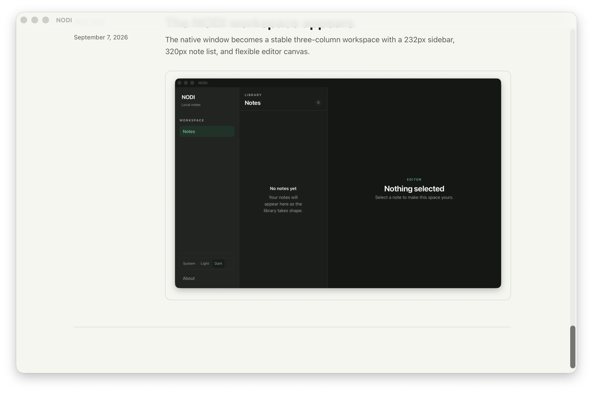

## 008 — DB-002 Migration runner

**Completed:** September 7, 2026

NODI now applies an immutable initial migration before opening the workspace. The migration creates the eight stable core tables inside a transaction, records schema version `1`, becomes a no-op on subsequent launches, and rolls back without recording a version if any statement fails.

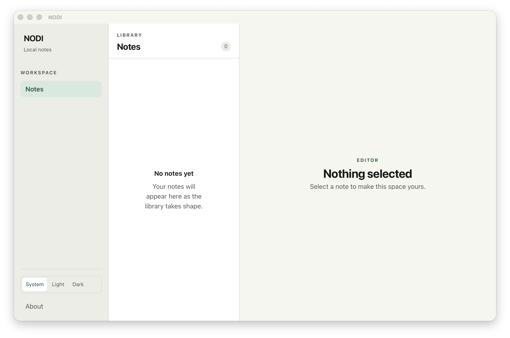

## 009 — DB-003 Device ID

**Completed:** September 7, 2026

NODI now gives every installation a stable local identity. On first launch it generates a UUID v7 (recorded as decision D-001) and stores it in the `settings` table; every later launch reuses the same value. The identifier is resolved during startup, right after migrations, so note creation can stamp each note with `device_id`, `revision`, and `updated_at` — preparing the schema for future multi-device sync without a redesign. No sync is implemented.

The workspace is visually unchanged; the evolution is in the startup sequence.

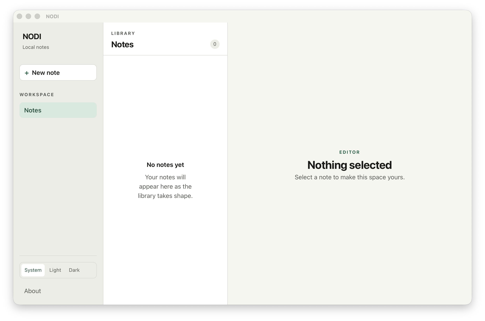

## 010 — NOTE-001 Note repository

**Completed:** September 7, 2026

Every note read or write now flows through a single repository: create, read, list, update, soft delete, restore, and permanent delete. All SQL is parameterized. Creating a note generates a UUID v7, stamps `created_at`/`updated_at`/`device_id`, and starts at `revision` 1; every update bumps `revision` and refreshes `updated_at`. Deletion is soft by default — the row and its body are preserved and can be restored — while list queries return a lightweight summary and can scope to the active list or the Trash view. Decision D-002 records that repositories return camelCase domain objects rather than raw rows.

No visible interface change yet; the notes list UI arrives with NOTE-002.

## 011 — NOTE-002 Notes list

**Completed:** September 7, 2026

The middle column becomes a live notes list, fed from the repository through TanStack Query. It has honest loading, error (with a non-destructive retry), and empty states, shows each note's title, a two-line plain-text preview, a relative timestamp, and a notebook marker, and is fully keyboard operable as a single-select listbox — arrow keys, Home/End, and Enter move and choose. The query client is created once in a new `providers.tsx`, with retries disabled because a failed local read will not fix itself.

## 012 — NOTE-003 New note

**Completed:** September 7, 2026

A "New note" action appears at the top of the sidebar, and ⌘N / Ctrl+N triggers it from anywhere in the workspace through a new central shortcut registry. Creating a note persists it immediately, adds it to the list without a reload, selects it, and moves focus to the editor column. The editor column itself becomes a small component that shows the selected note's title ("Untitled" when empty) ahead of the real Tiptap editor.

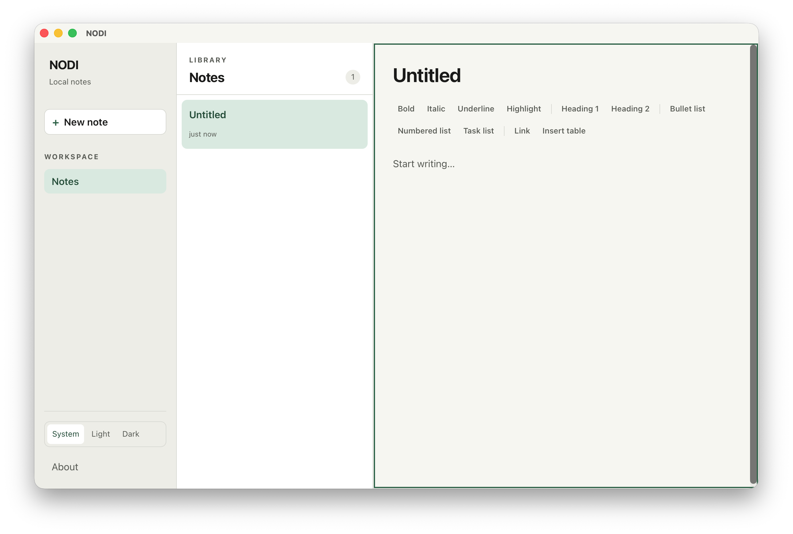

## 013 — EDIT-001 Tiptap base editor

**Completed:** September 7, 2026

The editor column becomes a real writing surface. The selected note's Tiptap JSON loads into a Tiptap editor with the fixed NODI extension set — paragraphs, headings, bold, italic, underline, highlight, links, bullet / numbered / task lists, and tables — plus a placeholder for empty notes. A sticky formatting toolbar exposes each capability with pressed-state feedback, and switching notes reloads the surface. Editing is in memory for now; autosave and save-error recovery arrive in EDIT-003 and EDIT-004.

## 014 — EDIT-002 Note title

**Completed:** September 7, 2026

The editor title is now a real input. Changes persist when focus leaves the field or Enter is pressed, the notes list refreshes immediately through the shared query cache, and an empty title continues to appear as “Untitled”. A failed write leaves the draft intact and visible instead of discarding it.

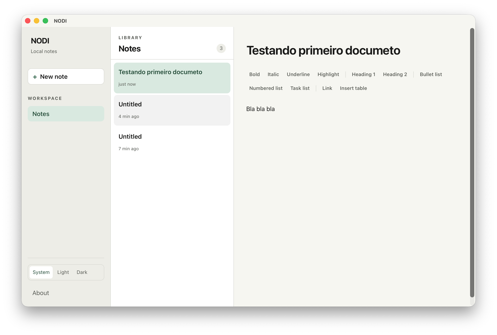

## 015 — EDIT-003 Autosave

**Completed:** September 7, 2026

Writing now saves itself. Every editor transaction updates local state immediately, then a 450 ms debounce persists canonical Tiptap JSON and regenerates the plain-text projection used by previews. Pending changes also flush on blur, note switch, application background, and close; a quiet status announces dirty, saving, and saved states.

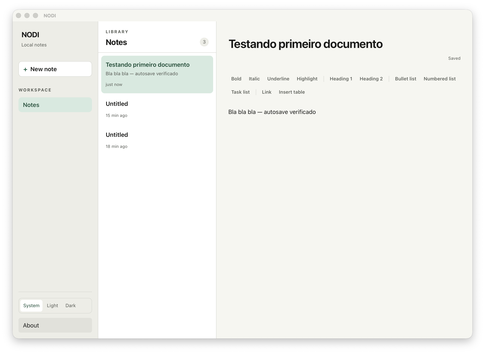

## 016 — EDIT-004 Save error recovery

**Completed:** September 7, 2026

A failed database write never clears the editor. NODI keeps the complete draft in memory, announces a visible non-destructive error, and offers an explicit “Try again” action for both body and title; a successful retry returns the subtle status to “Saved”.

## 017 — TRASH-001 Soft deletion

**Completed:** September 7, 2026

“Move to Trash” now performs a reversible soft deletion. The note disappears from the normal library, retains its complete title and Tiptap body in SQLite, and appears in a dedicated Trash view with the same accessible list navigation.

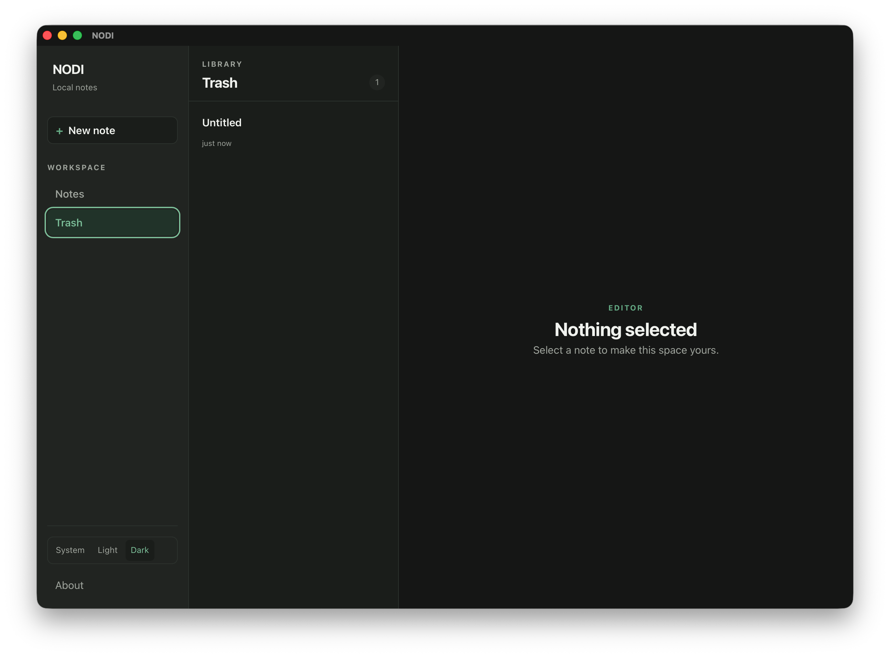

## 018 — TRASH-002 Restore

**Completed:** September 7, 2026

A trashed note can now return intact. Selecting it exposes “Restore note”; the repository clears `deleted_at`, refreshes `updated_at`, increments the revision, and moves the same record — including its complete Tiptap content — back to the normal library.

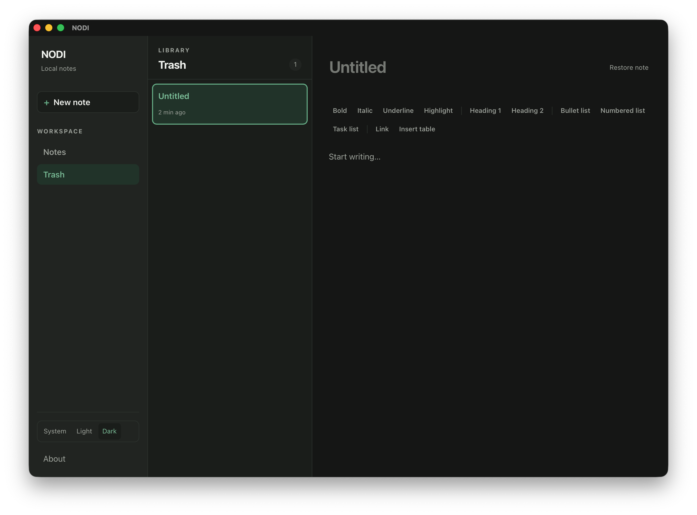

## 019 — TRASH-003 Permanent delete

**Completed:** September 7, 2026

Permanent deletion is now a deliberate, confirmed action. The accessible dialog keeps cancellation as the safe default; confirmation removes the note record while SQLite cascades its attachment metadata and tag relationships, and a database trigger removes its full-text search entry in the same transaction.

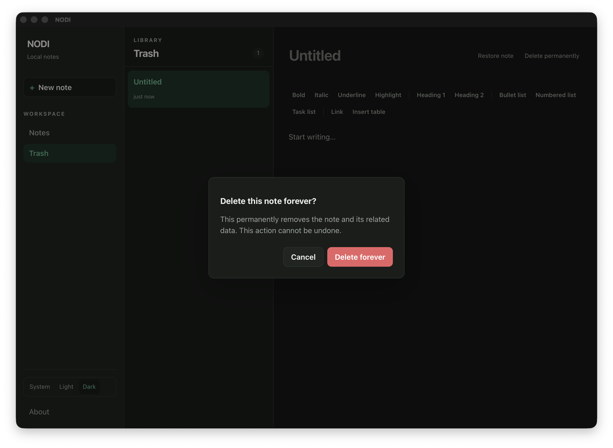

## 020 — NB-001 Notebooks

**Completed:** September 7, 2026

Notebooks now have a complete local lifecycle in the sidebar. NODI lists them alphabetically and supports keyboard-accessible creation, inline renaming, confirmed deletion, resilient loading, and non-destructive error feedback through one parameterized repository.

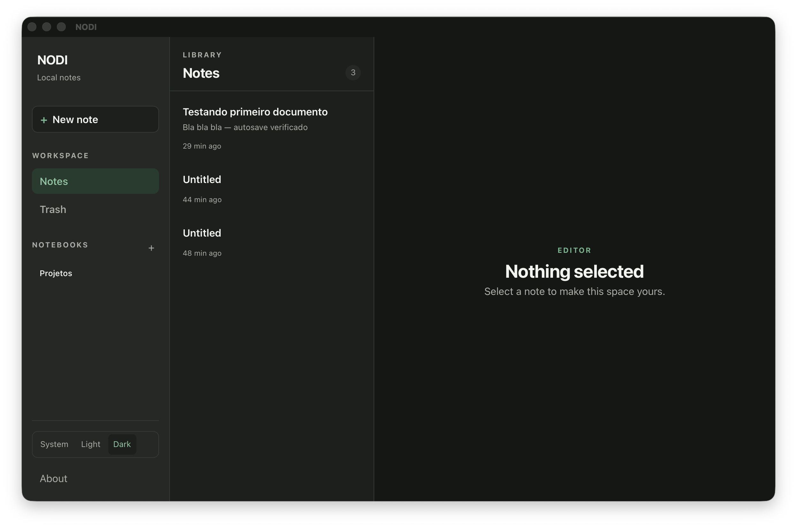

## 021 — NB-002 Move note

**Completed:** September 7, 2026

Every active note now exposes an accessible notebook selector. Moving a note persists `notebook_id`, refreshes the relevant query-backed lists immediately, and keeps notebook navigation in the sidebar synchronized; new notes also inherit the notebook currently being viewed.

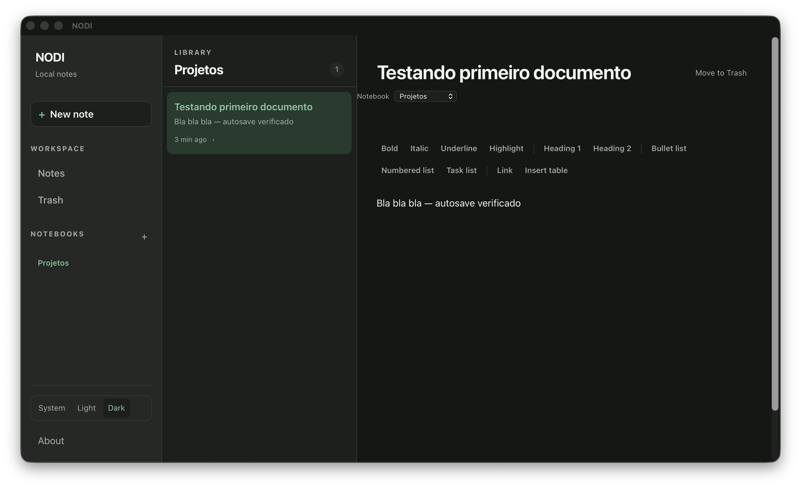

## 022 — NB-003 Notebook stacks

**Completed:** September 7, 2026

Notebooks can now be grouped into named stacks without drag-and-drop. Stack creation, renaming, confirmed deletion, and notebook assignment are keyboard accessible; deleting a stack leaves its notebooks intact and ungrouped through a database trigger applied in migration 3.

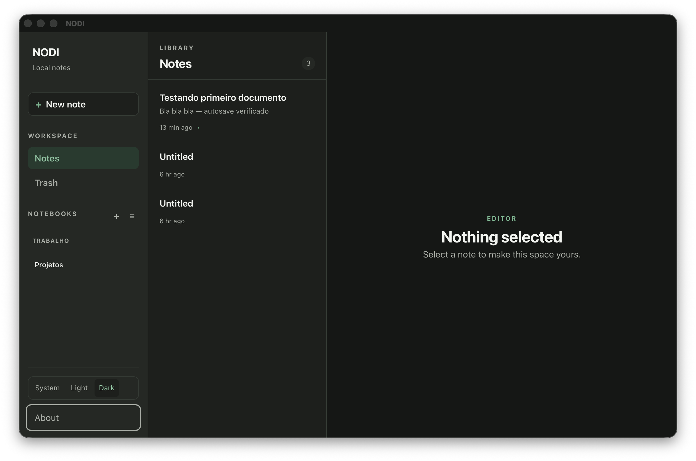

## 023 — TAG-001 Tags

**Completed:** September 7, 2026

Tags now provide a compact local vocabulary in the sidebar. Their repository enforces non-empty, unique names and supports alphabetical listing, creation, inline renaming, and confirmed deletion; deleting a tag safely removes only its note relationships through the existing cascade.

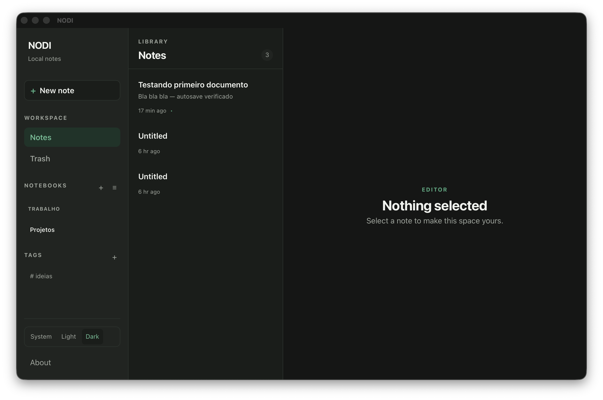

## 024 — TAG-002 Note tags

**Completed:** September 7, 2026

Notes can now carry any number of tags through an accessible metadata control. Adding and removing relationships leaves note content untouched, refreshes query-backed views immediately, and each tag in the sidebar opens a filtered, keyboard-navigable library.

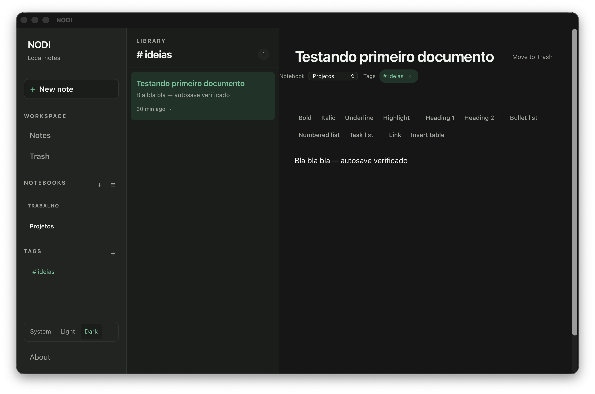

## 025 — SHORT-001 Favorites

**Completed:** September 7, 2026

Notes and notebooks can now be starred into a persistent Shortcuts section and opened in one action. Duplicate targets are prevented by migration 4, removal never touches source data, and database triggers automatically clean shortcuts when their target is permanently deleted.

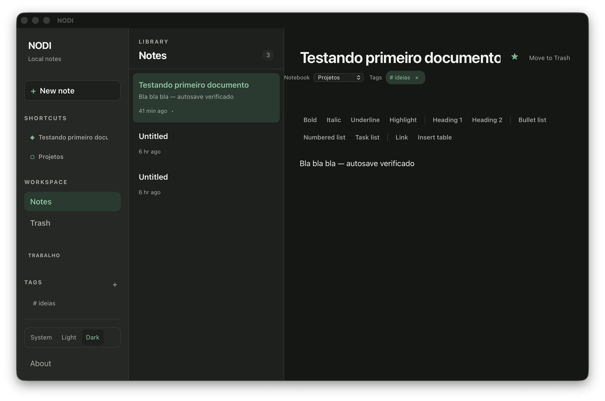
